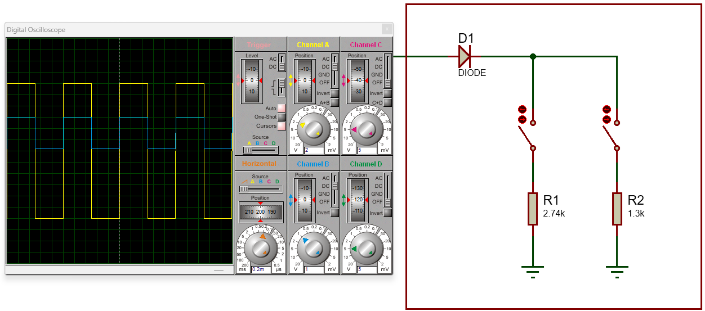
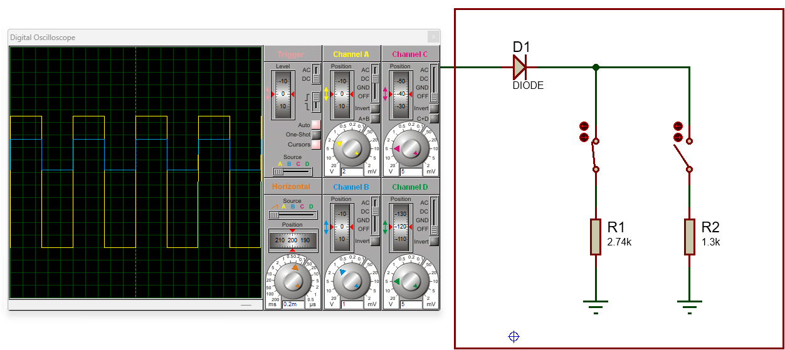
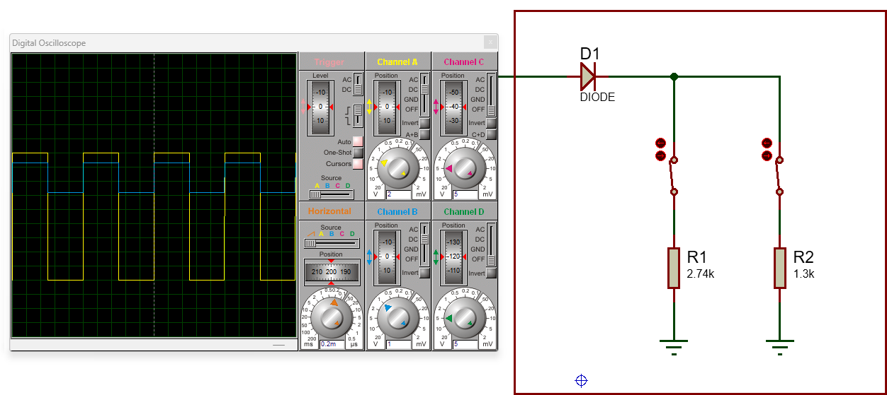

# Simulação Simplificada da Estação de Recarga
Esta parte do projeto tem como objetivo descrever o funcionamento de uma simulação que representa os principais aspectos operacionais da estação de recarga. A simulação visa demonstrar como a estação se comunica com os veículos elétricos.

Como detalhado na seção [Definição dos parâmetros de funcionamento](Definição%20dos%20parâmetros%20de%20funcionamento.md#Protocolo-de-Comunicação---Control-Pilot) a comunicação entre a estação de recarga e o veículo é realizada por meio do sinal Control Pilot. Este sinal é baseado em uma modulação por largura de pulso (PWM) de 1 kHz, na qual a amplitude máxima indica o estado da estação, enquanto a razão cíclica transmite a corrente máxima que a estação pode fornecer ao veículo.

## Simulação

O desenvolvimento do projeto será realizado com a utilização de um microcontrolador, que será encarregado de gerar o sinal PWM e processar os diferentes estados da estação de recarga. Com objetivo de simplificar a simulação será apenas considerado o sinla PWM gerado pelo mircocontroladro. Também será considerado as resistências que controlam os estados de carregamento para simular o comportamento do carro elétrico do ponto de vista do sinal CP.

Como visto na [Definição dos parâmetros de funcionamento](Definição%20dos%20parâmetros%20de%20funcionamento.md) o sinal Control Pilot (CP) opera em 12V DC ou como um PWM variando entre +12V e -12V, com sua amplitude ajustada conforme as resistências controladas pelo veículo elétrico. Para gerar esse sinal, é necessário um amplificador operacional com alimentação simétrica de +12V e -12V. O sinal PWM gerado pelo microcontrolador varia entre +3.3V e 0V. O amplificador operacional compara esse PWM com um nível de referência de +1.65V, resultando no sinal desejado na saída. Assim, quando o sinal PWM é 3.3V, a saída do comparador fornece +12V, e quando o sinal PWM é 0V, a saída do comparador se ajusta para -12V.

    

O microcontrolador precisa medir a amplitude do sinal PWM do CP para identificar o estado da estação de recarga. Para isso, é necessário ajustar o sinal para que ele esteja dentro do limite de operação do microcontrolador, que é de 0V a 3.3V. Esse ajuste é feito utilizando a alimentação de +3.3V e um divisor de tensão com resistores, o que permite reduzir a amplitude e eliminar a tensão negativa do sinal. Além disso, para garantir que a medição do sinal CP não seja influenciada, um amplificador operacional é utilizado como buffer, proporcionando isolamento à medida. Dessa forma, o microcontrolador consegue fazer a leitura do sinal e determinar os diferentes estados da estação de recarga com base na amplitude do sinal PWM.

    

Simulando o circuito temos que a onda quadrada em amarelo é o sinal do CP que vai para o carro e a onda quadrada em azul (CP_READ) que será utilizada para determinar a amplitude do sinal do CP. Podemos observar que ao variar os resistores que determinam os estados a amplitude do sinal se altera como esperado e a onda quadrada em azul sem mantem dentro faixa de 0V a 3.3V.

    

    

    

