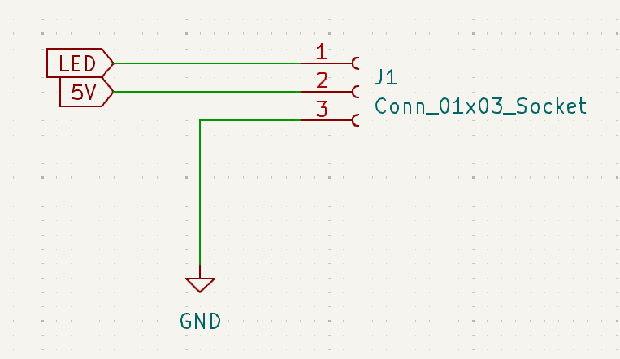

# Esquemático

O esquemático do projeto será dividio nos seguintes circuitos

- Control Pilot
- Microcontroldor
- Proteções
- Acionamento dos relés
- LEDs

# Control Pilot

Como já foi discutido antes na [Definição dos parâmetros de funcionamento](Definição%20dos%20parâmetros%20de%20funcionamento.md) o circuito do Control Pilot tem como objetivo gerar o sinal de comunicação com o veículo, podendo ser PWM ±12V 1kHz ou +12V sem PWM. Para isso foi desenhado um circuito semelhante ao apresentado na simulação, utilizando comprardor. Para que seja possível obter as saídas de +12V e -12V foi considerado o comparador [TLV1805](https://www.ti.com/lit/ds/symlink/tlv1805-q1.pdf?ts=1729874561037&ref_url=https%253A%252F%252Fbr.mouser.com%252F) que possui saída muito próximo da sua alimentação.

    

O comparador faz a comparação do PWM gerado pelo STM32 de +3V3 a 0V com 3V3/2 tendo na sáida o sinal PWM de ±12V que comunica com o carro.

# Microcontrolador

O circuto do microcontrolador é simples. Precisa apenas das alimentações, capacitores de desacoplamento para reduzir ruido, cristal oscilador, conexões com os demais circuitos e as conexões necessárias para programar o STM32F030.

    

# Proteções

O circuito de proteção apresenta um fusível e um varistor, na fase e no neutro para conter surtos de tensão ou curto-circuito. Se um surto de alta tensão ocorrer (por exemplo, um pico causado por um raio), o varistor age para limitar a tensão excessiva, evitando que ela chegue aos componentes sensíveis. Se houver um aumento excessivo de corrente, o fusível será acionado, interrompendo o fluxo de corrente e protegendo o circuito de danos.

    

Também foi utilizado um trnsformador para filtro de modo diferencial. Um transformador de filtro de modo diferencial funciona atenuando ruídos elétricos que aparecem entre as linhas de fase e neutro de um circuito, filtrando interferências que poderiam afetar o funcionamento de dispositivos eletrônicos. Ele é projetado com enrolamentos que criam uma impedância para sinais de alta frequência no caminho diferencial (entre fase e neutro), enquanto permite que a corrente de potência em baixa frequência passe sem ser afetada. Ao bloquear esses ruídos, o transformador ajuda a melhorar a qualidade da energia elétrica no circuito, reduzindo a interferência eletromagnética e o ruído conduzido. 

# Acionamento dos relés

Os relés selecionados para a construção da estação de recarga são acionados por uma tensão de 12V. Para isso, é necessário um driver de acionamento que recebe o sinal de controle do microcontrolador e, a partir da fonte de alimentação de 12V, aciona os relés.

    

# LEDSs

A interface homem máquina selecionada para estação de recarga será LEDs RGB do tipo WS2812 sendo possível determinar cores diferentes para indicar cada estado.

| Estado           | Cor            |
|------------------|----------------|
| Estado A         | Branco         |
| Estado B Pronto  | Branco piscando|
| Estado B Carregado | Verde         |
| Estado C         | Verde piscando |
| Estado E         | Vermelho       |
| Estado F         | Vermelho       |

A comunicação do WS2812 é baseada em um protocolo de serial de 1 fio, onde dados de 24 bits (8 bits para cada cor: vermelho, verde e azul) são transmitidos para controlar individualmente a cor de cada LED. O sinal de controle é enviado do microcontrolador para os LEDs em sequência, com cada LED recebendo seus 24 bits e transmitindo os dados para o próximo na cadeia. A comunicação NRZ (Non-Return to Zero) é um tipo de codificação de linha utilizado para distinguir os bits 0 e 1, com pulsos de diferentes durações.

Para o esqumático será considerado alimentação de 5V para os LEDs e a comunicação será feita diretamente pelo microcontrolador.

    

Como será utilizado uma fita de LED será necessário apenas um conector com alimentação e o sinal controle das cores, para que os LEDS possam funcionar.

