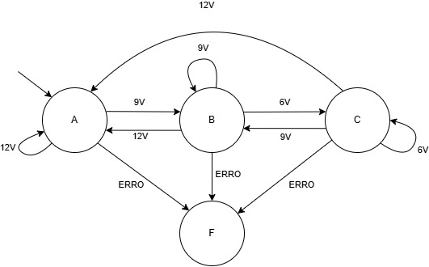

# Montagem prática

Para facilitar o desenvolvimento prático do projeto, seguiu-se a seguinte metodologia, com os seguintes passos:

- Construção da PCB
- Programação do micrcontrolador
- Desenho 3D do gabinete
- Impressão 3D do gabinete
- Montagem da PCB em partes
- Testes finais
  
# Construção da PCB

Para a construção da PCB, foi adotado um método diferente do que usualmente é utilizado no IFSC. Foi escolhido esse método por conta da complexidade do layout da placa e pela necessidade do use de face dupla, o que adicionava um nível de dificuldade ao processo. No entanto, apesar dessa tentativa, o resultado final não atendeu às expectativas de qualidade desejadas.

por conta disso, foi decidido solicitar a fabricação da PCB através da JLCPCB, uma empresa especializada nesse tipo de serviço. Essa mudança garantiu uma maior precisão e qualidade na fabricação da placa.

## Processo de fabricação

O desenho da placa foi realizado utilizando uma impressora 3D e um módulo laser, o que garante maior qualidade em comparação com o método de transferência de toner, especialmente em PCBs de dupla face, já que o processo de alinhamento se torna mais fácil e preciso.

O primeiro passo na fabricação da PCB utilizando o laser é o tratamento inicial da placa. Primeiramente, é necessário cortar a placa no tamanho desejado e remover a camada de cobre exposta de ambos os lados da PCB. Para isso, utiliza-se uma lixa fina para eliminar imperfeições sem danificar a superfície. Em seguida, realiza-se o polimento do cobre. Nesse caso, foi utilizada a pasta de polimento conhecida como Brasso. Esse processo é essencial, pois remove a camada de cobre exposta que pode oxidar devido ao contato com o ar. Caso essa etapa não seja realizada corretamente, o processo de fabricação e a qualidade final da PCB podem ser comprometidos, além de dificultar a soldagem dos componentes.

Após o tratamento da PCB, aplica-se uma tinta de máscara de solda em toda a superfície de cobre de ambos os lados da placa. Para garantir uma aplicação uniforme da tinta, utiliza-se uma tela de serigrafia e um pincel de borracha para evitar danos à tela. Em seguida, a tinta é exposta à luz ultravioleta para secar.

O próximo passo é configurar os arquivos para o desenho da PCB e os furos de alinhamento. São necessários cinco arquivos no total: o desenho dos furos de alinhamento, o desenho da camada superior, o desenho da camada inferior, o desenho dos pads superiores e o desenho dos pads inferiores. Vale destacar que todos os desenhos da parte inferior da PCB devem ser espelhados.

Para realizar o alinhamento da PCB, foi utilizado papel Paraná, um tipo de papelão denso e rígido que pode ser facilmente cortado pelo laser. Primeiramente, recortam-se retângulos de papel Paraná, que são fixados na mesa da impressora com fita crepe e nas laterais da PCB. Para garantir que o alinhamento não se perca, é fundamental que o papel não saia de posição durante o processo. Após o desenho na PCB, será necessário corroer o cobre sem perder o alinhamento. Para proteger os papéis de alinhamento durante a corrosão, utiliza-se fita isolante, que ajuda a impermeabilizar o material.

Após posicionar o papel Paraná corretamente, são feitos furos redondos para marcar o alinhamento preciso da PCB na mesa da impressora. Pinos são inseridos nesses furos para manter a posição da PCB. Os furos de alinhamento devem ser simétricos em relação aos eixos em que a PCB será virada. Em seguida, o desenho da camada superior é feito, a PCB é invertida e o desenho da camada inferior é realizado.

Após a realização dos desenhos no circuito, é necessário realizar novamente o polimento do cobre que será corroído. Este passo remove qualquer resíduo que possa ter ficado na superfície do cobre e garante que a corrosão seja mais uniforme. Essa etapa foi negligenciada durante a confecção da PCB, o que causou erros no processo de corrosão. É importante ressaltar que o alinhamento deve ser mantido, pois, após a corrosão, ainda será necessário desenhar os pads superiores e inferiores.

Uma vez concluído o polimento, o próximo passo é realizar a corrosão do cobre. Após a corrosão, a PCB deve ser colocada novamente na impressora, alinhando os furos e reposicionando os pinos de alinhamento para desenhar os pads superiores e inferiores.

A última etapa para finalizar a fabricação da PCB é a furação, que pode ser feita utilizando o próprio laser ou brocas do tamanho adequado. O uso do laser permite fazer furos menores, mas utilizando brocas e uma furadeira de bancada, o acabamento final tende a ser de melhor qualidade.

Esse processo de fabricação ainda está sendo aprimorado e testado. Por esse motivo, o resultado obtido não foi satisfatório, o que levou à decisão de solicitar a fabricação da PCB na JLCPCB. Com mais testes e ajustes nas configurações, há grande confiança de que será possível fabricar placas de circuito impresso de alta qualidade em pouco tempo, utilizando apenas uma impressora 3D e um módulo a laser. Além disso, será estudado formas de realizar furos metalizados e aplicar serigrafia utilizando esse método de fabricação. A inspiração desse método foi tirada do canal do youtube ForOuerOwnGood.

# Modelagem 3D do Gabinete
A modelagem 3D do gabinete foi realizada utilizando o Onshape, um software gratuito e online. Para garantir as dimensões corretas, utilizei o modelo 3D da placa com seus componentes, gerado pelo KiCad. Isso permitiu dimensionar o gabinete de maneira precisa, assegurando que todas as partes se encaixassem corretamente. O material escolhido para a impressão foi o PETG, devido à sua maior resistência mecânica e térmica em comparação ao PLA. A parte transparente, utilizada como difusor para os LEDs, foi impressa com o material Tritan. A impressão foi feita em duas partes: a tampa superior, em preto, e a tampa inferior, em branco.

# Desenvolvimento do Softwarer

Os estados D e E foram desconsiderados no funcionamento da estação de recarga, pois o estado D não é comumente utilizado, enquanto o estado E pode ser substituído pelo estado F, sem comprometer o desempenho básico do sistema. Como discutido na Etapa 1, o estado D é similar ao estado C, mas com a diferença de que o veículo informa à estação a necessidade de ventilação. Por outro lado, o estado E representa um erro conhecido, mas todos os erros serão tratados no estado F. A lógica de transição entre os estados é ilustrada nas fogiras abaixo:

<p align="center">
    
</p>

<p align="center">
    
</p>

Para implementar máquina de estados da estação de recarga, foi utilizado o conceito de ponteiro de funções para gerenciar e transitar entre diferentes estados. A linha de código a seguir foi usada para criar uma tabela (vetor) de ponteiros para funções, onde cada elemento do vetor aponta para uma função que representa um estado específico da máquina de estados:

```c
void (*tabela_estados[])(char) = {estado_a, estado_b, estado_c, estado_e, estado_f};
```
