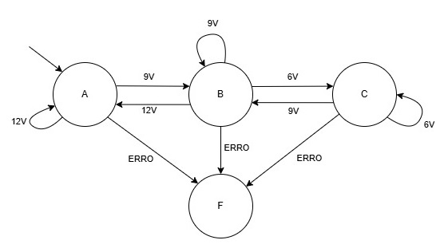

# Montagem prática

Para facilitar o desenvolvimento prático do projeto, seguiu-se a seguinte metodologia, com os seguintes passos:

- Construção da PCB
- Programação do micrcontrolador
- Desenho 3D do gabinete
- Impressão 3D do gabinete
- Montagem da PCB em partes
- Testes finais
  
# Construção da PCB

Para a construção da PCB, foi adotado um método diferente do que usualmente é utilizado no IFSC. Foi escolhido esse método por conta da complexidade do layout da placa e pela necessidade do use de face dupla, o que adicionava um nível de dificuldade ao processo. No entanto, apesar dessa tentativa, o resultado final não atendeu às expectativas de qualidade desejadas.

por conta disso, foi decidido solicitar a fabricação da PCB através da JLCPCB, uma empresa especializada nesse tipo de serviço. Essa mudança garantiu uma maior precisão e qualidade na fabricação da placa.

## Processo de fabricação

O desenho da placa foi realizado utilizando uma impressora 3D e um módulo laser, o que garante maior qualidade em comparação com o método de transferência de toner, especialmente em PCBs de dupla face, já que o processo de alinhamento se torna mais fácil e preciso.

O primeiro passo na fabricação da PCB utilizando o laser é o tratamento inicial da placa. Primeiramente, é necessário cortar a placa no tamanho desejado e remover a camada de cobre exposta de ambos os lados da PCB. Para isso, utiliza-se uma lixa fina para eliminar imperfeições sem danificar a superfície. Em seguida, realiza-se o polimento do cobre. Nesse caso, foi utilizada a pasta de polimento conhecida como Brasso. Esse processo é essencial, pois remove a camada de cobre exposta que pode oxidar devido ao contato com o ar. Caso essa etapa não seja realizada corretamente, o processo de fabricação e a qualidade final da PCB podem ser comprometidos, além de dificultar a soldagem dos componentes.

Após o tratamento da PCB, aplica-se uma tinta de máscara de solda em toda a superfície de cobre de ambos os lados da placa. Para garantir uma aplicação uniforme da tinta, utiliza-se uma tela de serigrafia e um pincel de borracha para evitar danos à tela. Em seguida, a tinta é exposta à luz ultravioleta para secar.

O próximo passo é configurar os arquivos para o desenho da PCB e os furos de alinhamento. São necessários cinco arquivos no total: o desenho dos furos de alinhamento, o desenho da camada superior, o desenho da camada inferior, o desenho dos pads superiores e o desenho dos pads inferiores. Vale destacar que todos os desenhos da parte inferior da PCB devem ser espelhados.

Para realizar o alinhamento da PCB, foi utilizado papel Paraná, um tipo de papelão denso e rígido que pode ser facilmente cortado pelo laser. Primeiramente, recortam-se retângulos de papel Paraná, que são fixados na mesa da impressora com fita crepe e nas laterais da PCB. Para garantir que o alinhamento não se perca, é fundamental que o papel não saia de posição durante o processo. Após o desenho na PCB, será necessário corroer o cobre sem perder o alinhamento. Para proteger os papéis de alinhamento durante a corrosão, utiliza-se fita isolante, que ajuda a impermeabilizar o material.

Após posicionar o papel Paraná corretamente, são feitos furos redondos para marcar o alinhamento preciso da PCB na mesa da impressora. Pinos são inseridos nesses furos para manter a posição da PCB. Os furos de alinhamento devem ser simétricos em relação aos eixos em que a PCB será virada. Em seguida, o desenho da camada superior é feito, a PCB é invertida e o desenho da camada inferior é realizado.

Após a realização dos desenhos no circuito, é necessário realizar novamente o polimento do cobre que será corroído. Este passo remove qualquer resíduo que possa ter ficado na superfície do cobre e garante que a corrosão seja mais uniforme. Essa etapa foi negligenciada durante a confecção da PCB, o que causou erros no processo de corrosão. É importante ressaltar que o alinhamento deve ser mantido, pois, após a corrosão, ainda será necessário desenhar os pads superiores e inferiores.

Uma vez concluído o polimento, o próximo passo é realizar a corrosão do cobre. Após a corrosão, a PCB deve ser colocada novamente na impressora, alinhando os furos e reposicionando os pinos de alinhamento para desenhar os pads superiores e inferiores.

A última etapa para finalizar a fabricação da PCB é a furação, que pode ser feita utilizando o próprio laser ou brocas do tamanho adequado. O uso do laser permite fazer furos menores, mas utilizando brocas e uma furadeira de bancada, o acabamento final tende a ser de melhor qualidade.

Esse processo de fabricação ainda está sendo aprimorado e testado. Por esse motivo, o resultado obtido não foi satisfatório, o que levou à decisão de solicitar a fabricação da PCB na JLCPCB. Com mais testes e ajustes nas configurações, há grande confiança de que será possível fabricar placas de circuito impresso de alta qualidade em pouco tempo, utilizando apenas uma impressora 3D e um módulo a laser. Além disso, será estudado formas de realizar furos metalizados e aplicar serigrafia utilizando esse método de fabricação. A inspiração desse método foi tirada do canal do youtube ForOuerOwnGood.

# Modelagem 3D do Gabinete
A modelagem 3D do gabinete foi realizada utilizando o software online Oshape. Para garantir as dimensões corretas, foi utilizado o modelo 3D da placa, gerado pelo KiCad, facilitando o dimensionamento do gabinete, assegurando que todas as partes teriam o encaixe correto. O material escolhido para a impressão foi o PETG, devido à sua maior resistência mecânica e térmica em comparação ao PLA. A parte transparente, utilizada como difusor para os LEDs, foi impressa com o material Tritan. A impressão foi feita em 3 partes: a tampa superior, em preto, e a tampa inferior, em branco e o difusor em material transparente.

# Desenvolvimento do Softwarer

Os estados D e E foram desconsiderados no funcionamento da estação de recarga, pois o estado D não é comumente utilizado e apresenta o mesmo comportamento que o estado C, enquanto o estado E pode ser substituído pelo estado F, sem comprometer o desempenho básico do sistema. Como discutido na Etapa 1, o estado D é similar ao estado C, mas com a diferença de que o veículo informa à estação a necessidade de ventilação por conta de aquecimento durante o processo de recarga. Por outro lado, o estado E representa um erro conhecido, mas todos os erros serão tratados no estado F. A lógica de transição entre os estados é ilustrada nas fogiras abaixo:

<p align="center">
    
</p>

<p align="center">
    
</p>

Antes de iniciar a máquina de estados, o sistema é configurado.
```c
  HAL_ADCEx_Calibration_Start(&hadc);			//Calibração do ADC
  HAL_TIM_Base_Start_IT(&htim1);			//Inicialização do temporizador do timer 1 com interrupção
  HAL_TIM_Base_Start(&htim3);				//Inicialização do temporizador do timer 3
  HAL_UART_Receive_IT(&huart1, rx_buffer, 2);		//Inicialização da UART
  HAL_TIM_PWM_Start(&htim1, TIM_CHANNEL_3);		//Inicialização do PWM do timer 1 canal 3
  TIM1->CCR3 = (TIM1->ARR);				//Configurado a razão cíclica para 100%

  EVSE_Parametros params = {				//Configura os parâmetros da máquina de estads
		  .corrente = 16,
		  .canal_timer_led = TIM_CHANNEL_1,
		  .timer_pwm = &htim1,
		  .timer_led = &htim3
  };
```
Inicializando os periféricos e configurando o PWM com razão cíclica de 100%.

A implementação da máquina de estados foi realizada por meio de um vetor de ponteiros de função, onde cada posição do vetor corresponde a um estado específico. Cada função encapsula a lógica de um estado e sua possível transição. No código fornecido, a função `EVSE_ExecutarEstado` é responsável por executar a lógica do estado atual. Ela recebe um ponteiro para uma estrutura `EVSE_Parametros`, que contém os parâmetros necessários para a execução do estado.

Dentro da função, o estado atual é acessado por meio do vetor `tabela_estados`, que armazena as funções correspondentes a cada estado. O índice estado_atual define qual função será executada, e os parâmetros `params->corrente`, `params->timer_led` e `params->canal_timer_led` são passados para a função correspondente. Essa abordagem permite que a máquina de estados seja modular e flexível, já que a lógica de cada estado é encapsulada em uma função separada. Para realizar a transição entre estado, basta atualizar o valor de `estado_atual` para mudar o comportamento do sistema.

```c
void EVSE_ExecutarEstado(EVSE_Parametros *params) {
	tabela_estados[estado_atual](params->corrente, params->timer_led, params->canal_timer_led);
}
```

Em cada função chamada pela `tabela_estados` é feito as ações de cada estado.

#Estado A
```c
void estado_a(uint8_t corrente, TIM_HandleTypeDef *htim_led, uint8_t LED_TIM_CHANNEL){
	if(estado_atual != estado_anterior){
		TIM1->CCR3 = (TIM1->ARR);
		HAL_GPIO_WritePin(RELAY_GPIO_Port, RELAY_Pin, 0);
	}
	estado_anterior = estado_atual;
#ifdef debug
	printf(BOLD "ESTADO A" ANSI_RESET "\r\n");
#endif
	setAllLEDsToColor(255, 255, 255);
	WS2812_Send(htim_led, LED_TIM_CHANNEL);
	evse_state_logic_transition();
}
```
No estado A é mantido o PWM em 100%, configurado os leds para cor branco e garantido que os relés não estarão ativo.

#Estado B
```c
void estado_b(uint8_t corrente, TIM_HandleTypeDef *htim_led, uint8_t LED_TIM_CHANNEL){
	if(estado_atual != estado_anterior){
		TIM1->CCR3 = (TIM1->ARR)*27/100;
		HAL_GPIO_WritePin(RELAY_GPIO_Port, RELAY_Pin, 0);
	}
	estado_anterior = estado_atual;
#ifdef debug
	printf(BOLD YELLOW "ESTADO B" ANSI_RESET "\r\n");
#endif
	if(carregado_flag){
		setAllLEDsToColor(0, 255, 0);
		WS2812_Send(htim_led, LED_TIM_CHANNEL);
	} else {
		setAllLEDsToColor(255, 255, 0);
		WS2812_Send(htim_led, LED_TIM_CHANNEL);
	}
	evse_state_logic_transition();
}
```

No estado B é iniciado o PWM co razão cíclica de 27%, configurado os leds para cor verde no caso de a recarga ter finalizado ou amarelo no caso de estar iniciando uma recarga, e também garantido que os relés não estarão ativo

Estado C
```c
void estado_c(uint8_t corrente, TIM_HandleTypeDef *htim_led, uint8_t LED_TIM_CHANNEL){
	if(estado_atual != estado_anterior){
		TIM1->CCR3 = (TIM1->ARR)*27/100;
		HAL_GPIO_WritePin(RELAY_GPIO_Port, RELAY_Pin, 1);
	}
	estado_anterior = estado_atual;
#ifdef debug
	printf(BOLD GREEN "ESTADO C" ANSI_RESET "\r\n");
#endif

	green_effect(htim_led, LED_TIM_CHANNEL);
	evse_state_logic_transition();
}
```
No estado C é mantido o PWM com 27% de razzão cíclica, acionado os relés e ativada a animação dos LEDs RGBs para indicar o carregamento.

#Estado F
```
void estado_f(uint8_t corrente, TIM_HandleTypeDef *htim_led, uint8_t LED_TIM_CHANNEL){
	if(estado_atual != estado_anterior){
#ifndef debug
		TIM1->CCR3 = 0;
#endif
		HAL_GPIO_WritePin(RELAY_GPIO_Port, RELAY_Pin, 0);
	}
	estado_anterior = estado_atual;
#ifdef debug
	printf(BOLD RED "ESTADO F" ANSI_RESET "\r\n");
#endif
	setAllLEDsToColor(255, 0, 0);
	WS2812_Send(htim_led, LED_TIM_CHANNEL);
#ifdef debug
	evse_state_logic_transition();
#endif
}
```

No estado F, é garantido que os relés estão desativado, o PWM é dasbilitado e os LEDs são configurados para cor vermelha para indicar falha no sistema.

Para tratar a lógica da máquina de estados é chamado a função `evse_state_logic_transition()` no final dos `estado_a, estado_b, estado_c` em `estado_f` é preciso reniciar o sistema para voltar ao funcionamento normal.

```c
void evse_state_logic_transition() {
    int medida = read_pilot(); // Lê o valor do piloto (em mV)
#ifdef debug
    printf("%d""\r\n", medida);
#endif

    switch (estado_atual) {
        case ESTADO_A:
            if (medida >= 3070 && medida <= 3390) { // 3230 ± 160
                // Permanece no ESTADO_A
            } else if (medida >= 2671 && medida <= 2991) { // 2831 ± 160
                estado_atual = ESTADO_B;
            } else if (medida >= 2272 && medida <= 2592) { // 2432 ± 160
                estado_atual = ESTADO_B;
            } else {
                estado_atual = ESTADO_F;
            }
            break;

        case ESTADO_B:
            if (medida >= 2671 && medida <= 2991) { // 2831 ± 160
                // Permanece no ESTADO_B
            } else if (medida >= 3070 && medida <= 3390) { // 3230 ± 160
                estado_atual = ESTADO_A;
                carregado_flag = 0;
            } else if (medida >= 2272 && medida <= 2592) { // 2432 ± 160
                estado_atual = ESTADO_C;
                carregado_flag = 0;
            } else {
                estado_atual = ESTADO_F;
                carregado_flag = 0;
            }
            break;

        case ESTADO_C:
            if (medida >= 2272 && medida <= 2592) { // 2432 ± 160
                // Permanece no ESTADO_C
            } else if (medida >= 3070 && medida <= 3390) { // 3230 ± 160
                estado_atual = ESTADO_A;
            } else if (medida >= 2671 && medida <= 2991) { // 2831 ± 160
                estado_atual = ESTADO_B;
                carregado_flag = 1;
            } else {
            	estado_atual = ESTADO_F;
            }
            break;

        case ESTADO_E:
            if (medida >= 1476 && medida <= 1796) { // 1636 ± 160
                // Permanece no ESTADO_E
            }
            break;

        case ESTADO_F:
#ifdef debug
            if (medida >= 3070 && medida <= 3390) { // 3230 ± 160
                estado_atual = ESTADO_A;
            } else if (medida >= 2671 && medida <= 2991) { // 2831 ± 160
                estado_atual = ESTADO_B;
            } else if (medida >= 2272 && medida <= 2592) { // 2432 ± 160
                estado_atual = ESTADO_C;
            }
#endif
            break;
    }
}
```
Essa função determina o estado atual com base na medida realiza pela função `read_pilot()` que representa uma tensão, que possui uma relação com sinal Control Pilot, também é considerado uma tolerância de ±160 mV, essa tolerância corresponde a aproximadamente ±0,6 V no sinal Control Pilot.

`read_pilot()` precisa medir o sinal CP_READ, que dependendo do estado atual pode ser um sinal PWM on um sinal constante. Quando o sinal for um PWM é preciso realizar a medida da parte alta do sinal. Para isso é feito 100 medidas seguidas, que garante medidas em mais de um período do sinal, e somado os valores medidos a cima de 1 V, em seguida é tirado a média dos valores somados para evitar que medidas ruidosas causem um comportamento indesejado. O valor de CP_READ possui uma relação com o valor de Control Pilot, essa relação pode ser calculada pelo ciruito apresentado na Etapa 2, obtendo os valores de `CP_READ_ESTADO_A, CP_READ_ESTADO_B, CP_READ_ESTADO_C`.

<p align="center">
    
</p>

$$
\frac{CP-CP_{read}}{R_2}+\frac{3,3-CP_{read}}{R_3}-\frac{CP_{read}}{R_4}=0
$$

Isolando CP_READ temos:

$$
CP_{read}=\frac{CP\cdot R_3\cdot R_4+3,3\cdot R_2\cdot R_4}{R_2\cdot R_4 + R_2\cdot R_3 + R_3\cdot R_4}
$$

Com essa equação encontramos o valor de CP_READ que representa 12V, 9V, 6V, 0V e -12V no sinal Control Pilot.

```c
#define CP_READ_ESTADO_A	3230 //mV
#define CP_READ_ESTADO_B	2831 //mV
#define CP_READ_ESTADO_C	2432 //mV
#define CP_READ_ESTADO_E	1636 //mV
```

```c
uint16_t adc_sample[100] = {0};
int average = 0;
int sum = 0;
int n = 0;
uint16_t read_pilot(){
//	int adc_sample = 0;
//	int average = 0;
//	int n = 0;
	//adc_sample = {0};
	average = 0;
	n = 0;
	sum = 0;
	//ADC_Select_CH9();
	HAL_GPIO_WritePin(GPIOA, GPIO_PIN_12, 1);
	for(int i=0; i <= 100; i++){
		HAL_ADC_Start(&hadc);
		HAL_ADC_PollForConversion(&hadc, HAL_MAX_DELAY);
		adc_sample[i] = (HAL_ADC_GetValue(&hadc)*3300)/4095;
		if(adc_sample[i]>1000){
			sum += adc_sample[i];
			n++;
		}
//		if(HAL_ADC_GetValue(&hadc) > 1200){
//			adc_sample += HAL_ADC_GetValue(&hadc);
//			n++;
//		}
	}
	HAL_GPIO_WritePin(GPIOA, GPIO_PIN_12, 0);
	average = sum/n;
	return average;
//	if(adc_sample){
//		average = ((adc_sample/n)*3300)/4096;
//	}
//	return average;
}
```

Para controlar as cores dos LEDs RGB, é utilizado a função `set_led()` para selecionar a cor e o led e `WS2812_Send()` para enviar os dados.

A comunicação é feita pelo envio de 24 bits para cada led, sendo dividido em 8 bits para cor verde, 8 bits para a cor vermelha e 8 bits para o azul.

Os bits são transmitidos a cada 1,25 microssegundos, o que corresponde a uma frequência de 800 KHz. Para enviar o bit `1`, o sinal de comunicação deve permanecer em nível alto por aproximadamente dois terços do tempo `T1H` e em nível baixo por um terço do tempo `T1L`. Já para enviar o bit `0`, o sinal deve permanecer em nível alto por cerca de um terço do tempo `T0H` e em nível baixo por dois terços do tempo `T0L`. Após o envio dos dados é preciso manter o sinal em baixo por 50 microsegundos `Treset` para indicar a finalização da comunicação.

<p align="center">
    
</p>

Para realizar essa comunicação, utilizou-se o DMA para transferir as diferentes larguras de pulso para o temporizador, que, gera um sinal PWM com os dados definidos. A função `set_led()` configura a posição do led, e os dados de cores de 0 a 255.

```c
void set_led(int LEDnum, int red, int green, int blue){
	LED_Data[LEDnum][0] = LEDnum;
	LED_Data[LEDnum][1] = green;
	LED_Data[LEDnum][2] = red;
	LED_Data[LEDnum][3] = blue;
}
```

Para enviar os dados é feito uma verredura em todos os LEDs configurados e feito shift lógico para enviar os dados de cores verde, vermelho e azul nessa ordem. `pwmData` posui a informação da largura de pulso de cada bit que será enviado, e mais 50 valores `0` que são referentes ao `Treset` e devem estar presente no final de toda comunicação, em seguida é transmitido via DMA os dados para o PWM pela chamada da função `HAL_TIM_PWM_Start_DMA`. O timer do PWM está configurado para contar até 60, com uma frequência de 48 Mhz, o que corresponde aos 800 kHz exigidos pela comunicação. Para configurar um bit `1` é configurado a razção cíclica pela comparação do valor do timer com o valor 40 que correponde a 2 terços do tempo em alto. Para o bit `0` é comparado o valor do timer com o valor 20, que corresponde a 1 terço do tempo em baixo.

```c
void WS2812_Send(TIM_HandleTypeDef *htim, uint8_t TIM_CHANNEL) {
    uint32_t color;
    uint16_t indx = 2;

    pwmData[0] = 0;
    pwmData[1] = 0;

    for (int i = 0; i < NUM_LEDS; i++) {
        color = ((LED_Data[i][1] << 16) | (LED_Data[i][2] << 8) | (LED_Data[i][3]));

        for (int bit = 23; bit >= 0; bit--) {
            pwmData[indx++] = (color & (1 << bit)) ? 40 : 20;
        }
    }

    for (int i = 0; i < 50; i++) {
        pwmData[indx++] = 0;
    }

    HAL_TIM_PWM_Start_DMA(htim, TIM_CHANNEL, (uint32_t *)pwmData, indx);

    while (!datasentflag) {}
    datasentflag = 0;
}
```
Ao enviar os dados como explicado anteriormente, foi possível perceber que o segundo bit apresentava um comportamento inesperando 

Efeito verde otimizado

```c
void green_effect() {
    static const uint8_t green_values[3] = {255, 15, 15};  // Valores de verde

    uint16_t ind;
    uint8_t color_index;
    uint8_t factor1, factor2;

    for (uint16_t j = 0; j < 9; j++) {
        ind = effStep + j;
        color_index = (ind % 9) / 3;  // Determina o índice da cor (0, 1 ou 2)

        // Calcula os fatores de interpolação (0 a 255, em vez de 0.0 a 1.0)
        factor1 = 255 - ((ind % 3) * 85);  // 85 = 255 / 3
        factor2 = (ind % 3) * 85;

        // Interpolação apenas para o canal verde
        uint8_t green = (green_values[color_index] * factor1 + green_values[(color_index + 1) % 3] * factor2) >> 8;

        // Define a cor do LED (red e blue sempre 0)
        set_led(j, 0, green, 0);
    }

    // Envia os dados para a fita de LED
    WS2812_Send();

    // Atualiza o passo do efeito
    if (effStep >= 62) {
        effStep = 0;
    } else {
        effStep++;
    }
}
```

