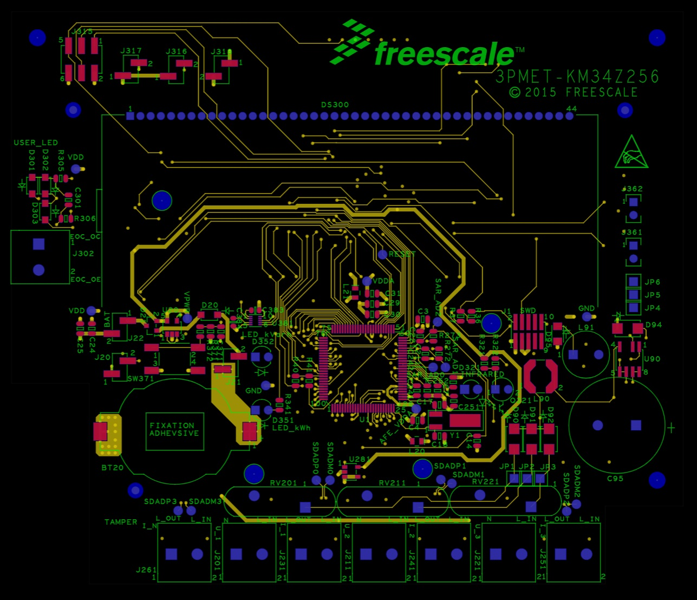
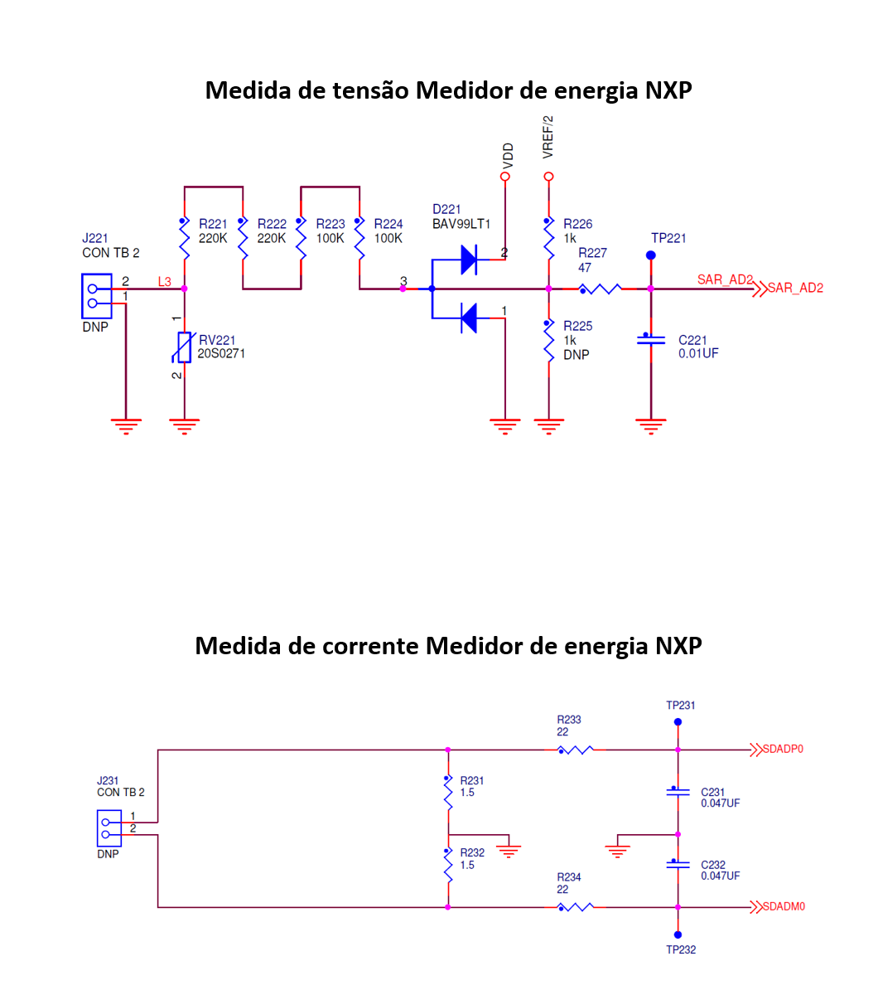

## Lista de Possíveis componentes

Objetivo: Classe A Erro < 1%

| Componente             | PART NUMBER                                   | LINK DE COMPRA                                |
|------------------------|-----------------------------------------------|-----------------------------------------------|
| **MCU**                | [STM32F373x](https://br.mouser.com/datasheet/2/389/stm32f373cc-1851083.pdf)| COMPRADO|
| **MCU Parte isolada**  | [STM32F030K6T6](https://www.acheicomponentes.com.br/circuitos-integrados/circuito-integrado-stm32f030k6t6-lqfp-32-smd)|[Achei Componentes](https://www.acheicomponentes.com.br/circuitos-integrados/circuito-integrado-stm32f030k6t6-lqfp-32-smd)|
| **Regulador Linear 3V3** | [AMS1117-3.3](https://www.acheicomponentes.com.br/cicruito-integrado-ams1117-3-3v-sot-223-smd)| [Achei Componentes](https://www.acheicomponentes.com.br/cicruito-integrado-ams1117-3-3v-sot-223-smd)|
| **Optoacoplador isolamento da UART**      | [6N137](https://br.mouser.com/datasheet/2/427/6n137-7681.pdf) [Documentação](https://electronics.stackexchange.com/questions/672452/serial-isolation-with-6n137-opto-coupler?rq=1)|[Achei Componentes](https://www.acheicomponentes.com.br/ci-aclopador-6n137-dip-8-preto-fairchild)|
| **Sensor de corrente** | [Shunt] de alta precisão ou transformador de corrente [Maxpow](https://produto.mercadolivre.com.br/MLB-2186412902-resistor-shunt-20a-75mv-_JM#position%3D2%26search_layout%3Dstack%26type%3Ditem%26tracking_id%3Dd6a363c0-c800-4786-b9d9-9d0a8bc0cf26); [Pionix](https://br.mouser.com/ProductDetail/Vishay-Dale/WSLF2512L5000FEA?qs=aVyJF2WnouT0Jqstwf%2Fe3A%3D%3D); [Aliexpress 100W](https://pt.aliexpress.com/item/1005007052244812.html?spm=a2g0o.productlist.main.107.439cP5CVP5CVaU&algo_pvid=8c7448fb-c480-4cd3-b774-078a9b019d7e&algo_exp_id=8c7448fb-c480-4cd3-b774-078a9b019d7e-53&pdp_npi=4%40dis%21BRL%2118.05%2116.56%21%21%2121.03%2119.29%21%402101c80017307559811707033e407e%2112000039238450051%21sea%21BR%21710310878%21X&curPageLogUid=V7NrRSy6OHKd&utparam-url=scene%3Asearch%7Cquery_from%3A)|
| **Sensor de Tensão**   | [Divisor resistivo de alta precisão](https://br.mouser.com/datasheet/2/385/sei_css_cssh-3077671.pdf) |
| **Comparador PWM**     | [TLV1805](https://www.ti.com/lit/ds/symlink/tlv1805-q1.pdf?ts=1729874561037&ref_url=https%253A%252F%252Fbr.mouser.com%252F) | COMPRADO |
| **Fonte**              | [HLK-PM12](https://nettigo.eu/attachments/503) | [Achei Componentes](https://www.acheicomponentes.com.br/modulos/modulo-mini-fonte-hi-link-12v-5w-0-42a-hlk-5m12)|
| **Relé**               |  JQX-15F (T90)  | [Achei Componentes](https://www.acheicomponentes.com.br/rele-12v-20a-6-pinos-jqx-15f-t90-fangke)|
| **Power Meter IC**     | [ADE7753ARSZ](https://br.mouser.com/datasheet/2/609/ADE7753-1502856.pdf)| [Achei Componentes](https://www.acheicomponentes.com.br/circuitos-integrados/smd/circuito-integrado-ade7753arsz-ssop-20-smd)|

## NXP 3 Phase Power Meter Gerber View

    

## Diagrama de blocos Monofásico

    

## Diagrama de blocos Trifásico

    

## Medida de corrente com shunt Pionix

    

## Medida de corrente com shunt Pionix

    

## SDACD STM32F373
- https://www.st.com/resource/en/application_note/an4207-getting-started-with-stm32f3738xxx-sdadc-sigmadelta-adc-stmicroelectronics.pdf

## Documentação sobre medida de corrente com shunt 
- https://br.mouser.com/applications/making-sense-current-sensing/
- https://www.escomponents.com/precision-current-sensing-guide4

## NXP Single-Phase Power Metering Reference Design
- https://www.nxp.com/design/design-center/development-boards-and-designs/single-phase-metering:SINGLE-PHASE-METER
  
## NXP Three-Phase Power Meter Reference Design
- https://www.nxp.com/design/design-center/development-boards-and-designs/three-phase-power-meter-reference-design:THREE-PHASE-POWER-METER

## Filter-Based Algorithm for Metering Applications
- https://www.nxp.com/docs/en/application-note/AN4265.pdf

## TI Single-Phase Electric Meter With Isolated Energy
- https://www.tij.co.jp/jp/lit/ug/tidu455a/tidu455a.pdf

## Isolação debug probe
- https://www.st.com/en/development-tools/st-link-v2.html

## Dicas do Renan
- Sigma delta é diferencial. Para medir tensão fase neutro o microcontrolador precisa estar com a ref no neutro
- NÃO CONECTAR O NOTEBOOK NO GRAVADOR QUANDO ESTIVER CONECTADO NA REDE, RISCO DE BOOM!
- Opto no pwm antes do ampop comparador do sinal CP para isolar o sinal
- Pesquisar sobre como fazer as contas sem fazer fft
- Se usar shunt considerar low side sensing para manter a mesma ref
- Pesquisar transformador que poderia resolver o problema da ref no neutro e manter as características de harmônicas
- pesquisar tranformador de corrente com erro baixo que poderia ser utilizado
- Perguntar pro Joabel sobre a fonte de alimentação do microcontrolador, se uma solução seria isolar com transformador, para ficar neutro como ref dos +12V e dps abaixar pra +3.3V com regulador linear. Teria que utilizar 3 fontes de 12V?
- Pra atingir o erro de 1% tem que calibrar para os componentes utilizados em software

## Salvar os dados
- Usar python para ler a porta serial e salvar os dados em um arquivo txt.

## Solução para o isolamento
- Utilizar o STM32F373 apenas para medida de energia e comunicar via UART isolado por opto para um STM32F030K6T6, que possui a máquina de estados do carregador

## Forum sobre falando sobre medida de tensão para medidor de energia
https://electronics.stackexchange.com/questions/336037/240v-ac-voltage-measurement-using-voltage-divider
Yes you can. But things become complicated quickly since there are a few other things to consider.

When you design such circuit you'd want to have as much resistance as possible to limit wasted power in the divider. You'd also want your divider to survive electrical fast transients (EFT) and other surges, thus your divider should be able to withstand those voltages.

But high total resistance makes common mode and noise pickup a problem. Yet low total resistance make dissipated heat a problem.
You could take 20 resistors to combat this, but then you'd also have the side effects of 20 resistors. (eg: space, inaccuracy and drift)

There several application notes around tackling this issue.
TI: slaa494a
Atmel: AVR465

Then you also have the problem of data acquisition, since you'd need to be doing RMS with enough bit depth and sample-rate. Which is quite cpu intensive.
And then the harmonics show up and your measurement is incorrect...

Notice that whenever you attach anything to live or neutral without high resistance or isolation you can't directly attach anything else anymore. No programmer without isolation, no USB, no oscilloscope.
Magic smoke will be released if you do.

# Calibração de Software vs. Tensão de Referência Precisa para o ADC (NotebookLM + Datasheet STM32F373)
Na sua aplicação, onde você precisa de medidas precisas e acuradas do ADC, tanto a precisão da tensão de referência quanto a calibração do ADC por software são importantes.
## Tensão de Referência:
- A tensão de referência determina a escala de conversão do ADC. Uma tensão de referência mais precisa resulta em medições mais precisas.
- VREFINT: O STM32F373xx possui uma tensão de referência interna (VREFINT) com uma tensão típica de 1,23 V e uma dispersão de ±10 mV em relação à temperatura. Isso significa que a VREFINT pode variar dentro dessa faixa, afetando a precisão das medições do ADC.
- Referência Externa: Se a sua aplicação requer precisão maior do que a fornecida pela VREFINT, você pode usar uma referência externa de alta precisão. [VREF+ no datasheet]
- Impacto da Dispersão: Conforme discutido anteriormente, a dispersão da VREFINT refere-se à variação da sua tensão. Essa variação impacta diretamente a precisão das medições do ADC.
## Calibração de Software:
- A calibração do ADC por software pode compensar erros de offset e ganho, melhorando a precisão das medições.
- Calibração Interna: O STM32F373xx possui uma função de calibração interna que pode ser executada após a inicialização.
- Calibração Personalizada: Você também pode implementar sua própria rotina de calibração, medindo uma tensão conhecida e ajustando o software para corrigir os erros.
## Recomendações:
- Para a maioria das aplicações: A calibração do ADC por software, em conjunto com a VREFINT, pode ser suficiente para obter medidas precisas e acuradas.
- Para alta precisão: Se a sua aplicação exigir a maior precisão possível, utilize uma tensão de referência externa de alta precisão e faça a calibração do ADC por software.
## Considerações Adicionais:
- Impedância da Fonte do Sinal: A impedância da fonte do sinal conectado ao ADC deve ser baixa para garantir a precisão da conversão.
- Ruído: Minimize o ruído no circuito de medição, utilizando técnicas adequadas de layout e filtragem.
- Temperatura: A temperatura pode afetar a precisão do ADC e da tensão de referência. Utilize um sensor de temperatura para compensar as variações de temperatura ou opere o sistema em uma faixa de temperatura controlada.
- Datasheet: Consulte o datasheet completo do STM32F373xx para obter informações detalhadas sobre as características do ADC e da VREFINT.
## Em resumo:
A calibração do ADC por software pode melhorar a precisão das medições, mas uma tensão de referência precisa é fundamental para obter a melhor precisão possível. A escolha entre VREFINT e uma referência externa depende dos requisitos de precisão da sua aplicação.
